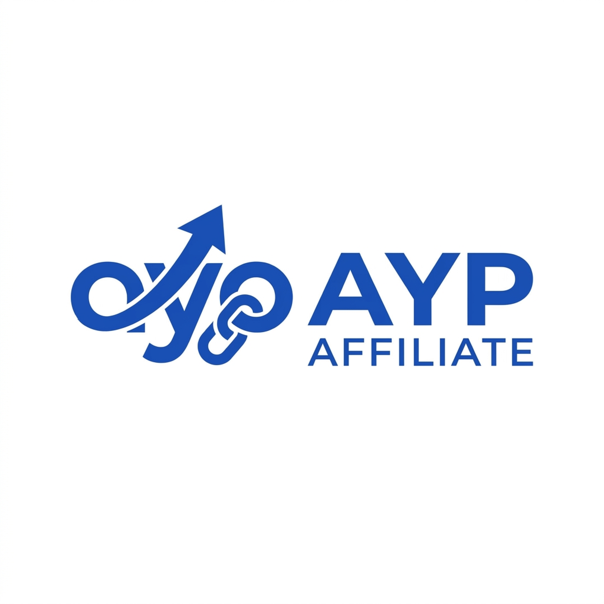

<p align="center">
  
</p>

<h1 align="center">AYP Affiliate</h1>

<p align="center">
  <strong>AYP Affiliate</strong> adalah platform showcase produk afiliasi yang dibangun menggunakan <strong>Next.js (App Router)</strong>. Aplikasi ini dirancang untuk menampilkan produk-produk terbaik dari marketplace seperti Shopee dan Tokopedia dengan dukungan filter kategori dan pencarian cepat.
</p>

<p align="center">
  Aplikasi dilengkapi dengan <strong>Dashboard Admin</strong> yang aman untuk mengelola kategori dan produk secara manual.
</p>

---

## 🚀 Fitur Utama

- **Public Showcase**: Grid produk responsif dengan filter pencarian instan dan navigasi kategori.
- **Admin Dashboard**: Halaman manajemen produk dan kategori khusus admin.
- **Hybrid Database**: Mendukung penggunaan database lokal **MariaDB/MySQL** untuk pengembangan bebas-biaya (*local development*), dan **Supabase (PostgreSQL)** untuk server produksi.
- **Data Migration Tool**: Script otomatis (`scripts/migrate.js`) untuk memigrasikan data kategori dan produk dari database lokal (MariaDB/MySQL) ke production (Supabase).
- **Security Hardening**:
  - Semua endpoint API admin (`/api/admin/*`) dilindungi oleh middleware.
  - Cookie sesi ditandatangani secara kriptografis menggunakan **Web Crypto API HMAC SHA-256**.
  - Bebas dari kerentanan SQL Injection dengan Prepared Statements.

---

## 🛠️ Tech Stack

- **Framework**: Next.js 16 (App Router, Turbopack)
- **Styling**: Tailwind CSS
- **Icons**: Lucide React
- **Database**: mysql2 (MariaDB/MySQL) / @supabase/supabase-js (PostgreSQL)
- **Token Signing**: Native Web Crypto API

---

## ⚙️ Cara Memulai

### 1. Setup Database
Rincian petunjuk instalasi dan impor skema database lokal (MariaDB) maupun awan (Supabase) dapat dilihat pada dokumen:
👉 **[PANDUAN SETUP DATABASE (GUIDE.md)](./GUIDE.md)**

### 2. Konfigurasi Environment Variables
Salin berkas `.env.example` menjadi `.env.local` dan lengkapi nilai variabelnya:
```bash
cp .env.example .env.local
```

### 3. Jalankan Server Pengembangan
Instal dependensi dan jalankan aplikasi secara lokal:
```bash
npm install
npm run dev
```

Buka [http://localhost:3000](http://localhost:3000) pada browser Anda untuk melihat hasilnya.

---

## 🏗️ Struktur Folder Utama

```
ayp-affiliate/
├── src/
│   ├── app/                 # Next.js App Router (Pages, Layouts, API Handlers)
│   ├── components/          # Reusable UI, Layout, & Admin components
│   ├── lib/
│   │   ├── db/              # Database Abstraction Layer (MySQL & Supabase wrappers)
│   │   ├── auth.ts          # Cryptographic Token Helper (Web Crypto)
│   │   └── utils.ts         # Styled utility helpers
│   ├── types/               # TypeScript interfaces
│   └── proxy.ts             # Authentication proxy middleware
├── supabase/                # SQL Schema files
├── scripts/                 # Migration script and helper utilities
├── GUIDE.md                 # Database setup tutorial
└── README.md                # Dokumentasi utama proyek
```
